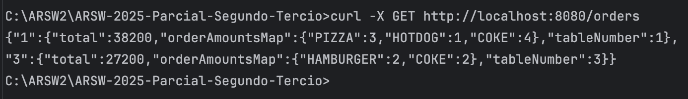
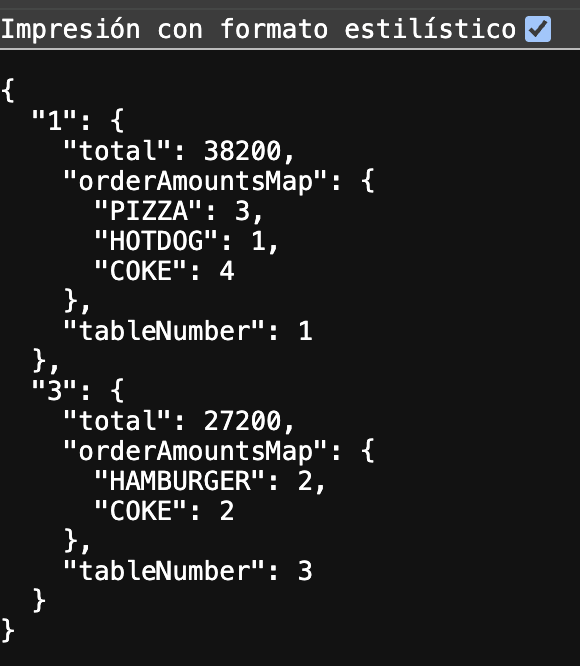
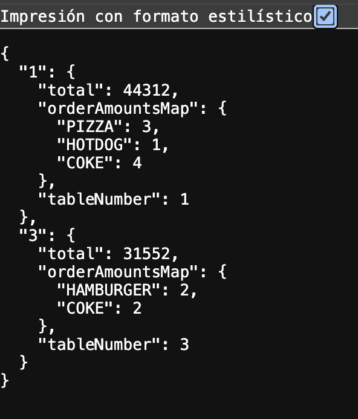

# Solución Parcial Segundo Corte - API REST para Cálculo de Cuentas de Restaurante

## Autor

* Jesús Pinzón

## Descripción

API REST desarrollada con Spring Boot para calcular el valor total de cuentas de restaurante, considerando diferentes políticas tributarias mediante el uso de inyección de dependencias y el principio de inversión de dependencias.

## Arquitectura

El sistema implementa diferentes estrategias de cálculo:

- **BasicBillCalculator**: Calcula cuentas sin impuestos
- **BillWithTaxesCalculator**: Calcula cuentas aplicando impuestos según el tipo de producto
- **StandardTaxesCalculator**: Aplica IVA estándar del 16% a todos los productos

## Requisitos

- Java 17 o superior
- Maven 3.6+
- Spring Boot 2.7.18

## Instalación y Ejecución

### 1. Clonar el repositorio
```bash
git clone 
cd ARSW-2025-Parcial-Segundo-Tercio
```

### 2. Compilar el proyecto
```bash
mvn clean install
```

### 3. Ejecutar la aplicación
```bash
mvn spring-boot:run
```

La aplicación estará disponible en `http://localhost:8080`

## Funcionalidad Implementada

### Endpoint GET /orders

Retorna todas las órdenes del restaurante con sus productos, cantidades y el total calculado.

**URL:** `GET http://localhost:8080/orders`

**Respuesta esperada:**
```json
{
  "1": {
    "total": 38200,
    "orderAmountsMap": {
      "PIZZA": 3,
      "HOTDOG": 1,
      "COKE": 4
    },
    "tableNumber": 1
  },
  "3": {
    "total": 27200,
    "orderAmountsMap": {
      "HAMBURGER": 2,
      "COKE": 2
    },
    "tableNumber": 3
  }
}
```

## Pruebas de Funcionamiento

### Paso 1: Compilación Exitosa
Ejecutar `mvn clean install` y verificar que el build sea exitoso.

### Paso 2: Aplicación Corriendo
Ejecutar `mvn spring-boot:run` y confirmar que la aplicación inicie correctamente en el puerto 8080.

### Paso 3: Prueba del Endpoint con cURL
Ejecutar en terminal:
```bash
curl -X GET http://localhost:8080/orders
```

**Captura:** `curl_test.png`



### Paso 4: Prueba desde Navegador
Abrir `http://localhost:8080/orders` en el navegador y verificar la respuesta JSON.

**Captura:** `browser_test.png`



### Paso 6 (BONO): Verificación de Inyección de Dependencias

## Implementación del Bono

Se implementó correctamente la inyección de dependencias usando:
- `@Service` en `BasicBillCalculator`
- `@Service` en `BillWithTaxesCalculator`
- `@Autowired` + `@Qualifier("basicBillCalculator")` en `RestaurantOrderServicesStub`
- `BillWithTaxesCalculator` utiliza internamente `StandardTaxesCalculator`

Pruebas con `billWithTaxesCalculator` IVA 16%:


